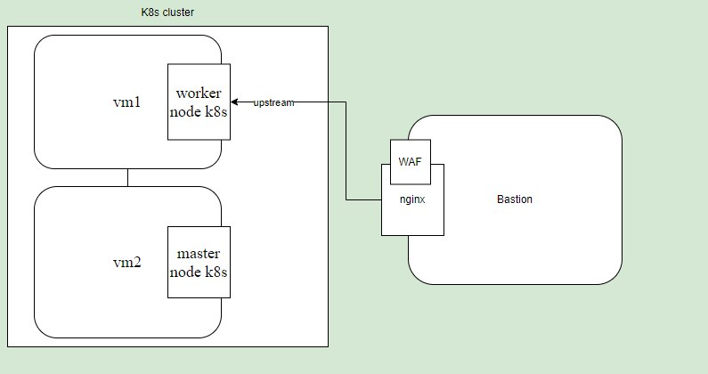

# В PDF файле проделанная мной работа
- Инфраструктура
- Мониторинг
- Деплой приложения
- Настройка nginx с ModSecurity WAF
- Первичный анализ на серверах

## Схематичное представление архитектуры отказоустойчивой инфраструктуры

